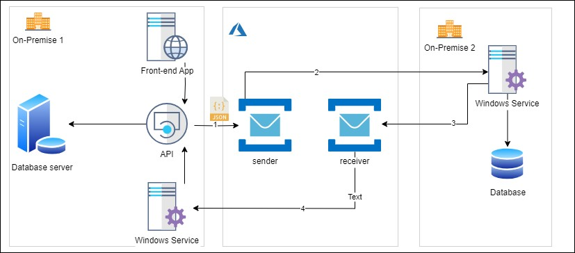

# .NET 6 Windows Service to read messages from Azure Service Bus Queue

## Overview

This source code will provide Windows Service which runs continously to receive messages from the Azure Service Bus Queue using Transport Type AQMPTCP.

Considering the use case 1, let's consider there are two different partner applications hosted in their respective on-premise environment and want to exchange their data. Since both the applications are in the respective corporate boundaries, the inbound connectivity is not allowed. Hence in this scenario integration between these two applications can be achieved using Azure Service Bus Queue.

## High-Level architecture

In the below architecture, two partner applications are using Azure Service Bus to exchange their data. 
	1. API sends the JSON message to the sender queue
	2. The On-Premise 2 windows service registers session handler for listening to messages written to the sender queue. It receives the message and processes it without continuously polling
	3. The On-Premise 2 windows service write ack to the receiver queue
	4. The On-Premise 1 windows service registers session handler for listening to messages written to the receiver queue to process the response received in the receiver queue.

## About the Project

## Publisher

The Publisher can be a library or API or function with below capabilities. In the ServiceBusMessage class, WriteMessageToServiceBusEntity method, performs below key functions
1. Writes message to the azure service bus queue
2. The entire operation of sending message to the queue is within TransactionScope. This means either all the messages will be written to the queue successfully or all will fail
3. The service bus client object created using endpoint url. The client object is used to create ServiceBusSender object using queue entity name for writing messages to the queue
4. Create a session when submitting messages into queue by setting the SessionId property to Unique trans id example : DateTime.Now.ToString("yyyyMMddHHmmssfff") + UserId that is unique to session
5. The azure service bus queue message has limit of maximum size of 256 KB. Hence large brokered message greater than 255 KB have to be split the messages into a sequence of smaller sub-messages that can be transmitted over the service bus messaging entities. Refer the section References for sample code. All the split messages will have same SessionID

## Subscriber

The Subscriber is the continuously running background service that can be deployed on-premise which keeps checking for any messages written to the Queue and process them. 
In the project, DoWork method creates multiple Session queue client using the queue configuration. Each queue client will register the message handler which needs to be executed when message arrives in the queue. The key configuration parameters to note are
1. ServiceBusSessionProcessorOptions.ReceiveMode is set to PeekLock. The processor will complete the message after executing the message handler
2. MaxConcurrentSessions - This is very helpful for better performance to process messages concurrently in multiple sessions
3. MaxConcurrentCallsPerSession -  maximum number of calls to the callback the processor will initiate per session

